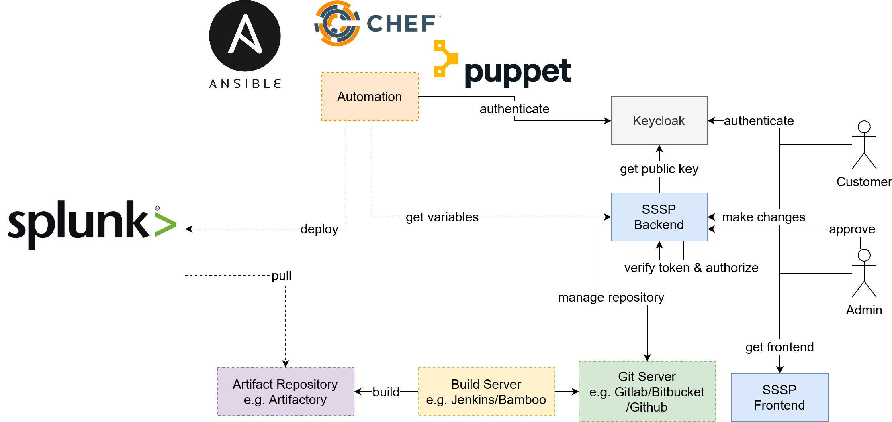

# Integration

The self service portal is not going to deploy anything. For deployment use your favorite tool (eg. Ansible, Puppet, Chef). The self service portal provides a Graphql interface, where the automation tool can get the parameters. It is shown schematically in the following picture:

Just keep in mind this is just a suggestion. There are a lot of different possiblities out there.

## Examples

In the Git repository are examples how to integrate the SSSP into you automation process.

- [Ansible](https://github.com/rafiwicht/sssp/tree/master/integration/ansible)
